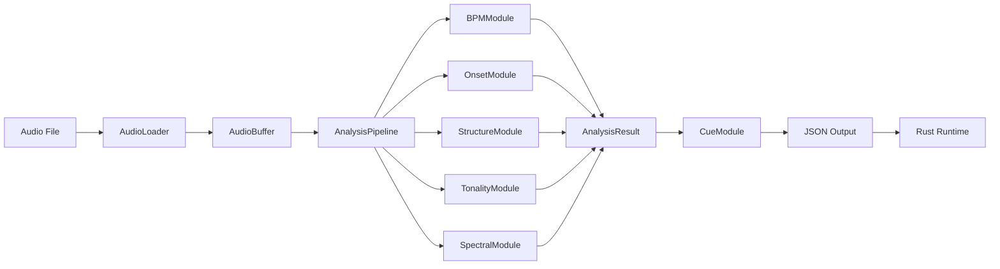

# Architecture Modulaire Audio-Visual Engine

## Structure des dossiers

```
AudioVisualEngine/
├── CppAnalysis/              # Analyse offline (C++)
│   ├── CMakeLists.txt
│   ├── include/
│   │   ├── core/
│   │   │   ├── AudioBuffer.h
│   │   │   ├── AnalysisResult.h
│   │   │   └── JsonContract.h
│   │   ├── modules/
│   │   │   ├── IAnalysisModule.h
│   │   │   ├── BPMModule.h
│   │   │   ├── OnsetModule.h
│   │   │   ├── StructureModule.h
│   │   │   ├── TonalityModule.h
│   │   │   ├── SpectralModule.h
│   │   │   └── CueModule.h
│   │   └── pipeline/
│   │       ├── AnalysisPipeline.h
│   │       └── AudioLoader.h
│   ├── src/
│   │   ├── core/
│   │   ├── modules/
│   │   └── pipeline/
│   └── tests/
│
├── RustRuntime/              # Runtime visuel (Rust)
│   ├── Cargo.toml
│   ├── src/
│   │   ├── core/
│   │   ├── visual_modules/
│   │   └── sync/
│   └── shaders/
│
└── shared/
    └── json_schema/
        └── analysis_v1.json

```

## Principe SOLID appliqué

### 1. **Single Responsibility**
Chaque module a une seule responsabilité:
- `BPMModule` → Détection BPM uniquement
- `OnsetModule` → Détection d'onsets uniquement
- `StructureModule` → Segmentation uniquement

### 2. **Open/Closed**
- Extension via nouveaux modules sans modifier le code existant
- Interface `IAnalysisModule` pour tous les modules

### 3. **Liskov Substitution**
- Tous les modules implémentent `IAnalysisModule`
- Interchangeables dans le pipeline

### 4. **Interface Segregation**
- Interfaces spécialisées par type d'analyse
- Pas de méthodes inutiles

### 5. **Dependency Inversion**
- Pipeline dépend d'abstractions (interfaces)
- Injection de dépendances pour les modules

## Flux de données



## Contrat JSON Versionné

- Version 1: Base minimale
- Rétrocompatibilité garantie
- Extension par ajout de champs optionnels
- Validation par schéma JSON

## Points d'extension

1. **Nouveaux modules d'analyse** → Implémenter `IAnalysisModule`
2. **Nouvelles features** → Étendre `AnalysisResult`
3. **Nouveaux formats audio** → Étendre `AudioLoader`
4. **Optimisations** → Remplacer implémentation sans changer interface